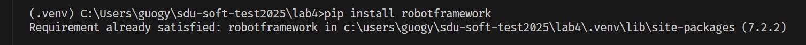
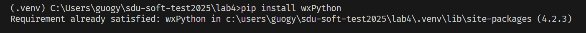

# 实验报告

- [ ] 学号：202200210057
- [ ] 姓名：郭冠洋
- [ ] 班级：菁英班

## 实验过程

- 测试工具：Robot Framework
- GUI:wxPython+ robotframework-ride

### 一. 安装工具

#### 1. 安装测试工具Robot Framework

```
pip install robotframework
```



```
pip install robotframework-requests
```


#### 2. 安装GUI:wxPython+ robotframework-ride

```
pip install wxPython
```



```
pip install robotframework-ride
```


### 二. 启动 RIDE 并创建测试项目/套件

#### 1. 打开ride并新建项目

```
ride
```


#### 2. 新建项目


#### 3. 新建测试套件


#### 4. 在测试套件中引入 RequestsLibrary


### 三. 定义基本变量和创建测试用例框架

#### 1. 添加URL作为变量


#### 2. 新建测试用例


#### 3. 配置测试用例

```
*** Test Cases ***
Test User Registration - Username Exists
    Create Session    mysession    ${BASE_URL}
    &{headers}=    Create Dictionary    Content-Type=${CONTENT_TYPE}
    &{body}=    Create Dictionary    username=testtest1    password=123    repassword=123    code=1234
    ${response}=    POST On Session    mysession    appRegister    json=${body}    headers=${headers}
    Should Be Equal As Strings    ${response.status_code}    200
    ${json_response}=    Set Variable    ${response.json()}
    Should Be Equal As Strings    ${json_response['success']}    ${FALSE}
    Should Be Equal As Numbers    ${json_response['code']}    20002
    Should Be Equal As Strings    ${json_response['message']}    用户名已存在
```

解释: 我们希望测试注册功能

我们新建请求,包括请求头和请求体

请求体中包含我们所需的四个参数

我们对返回体进行解析

并且给出了不同返回的不同解释


#### 4. 测试结果


可以看到已经注册成功了!

再次测试:


可以看到提示了用户已经存在

可以看到我们的第一次测试完成的非常成功.

#### 5. 进行另一个测试:密码错误功能

```
Test User Login - Password Error
    Create Session    mysession    ${BASE_URL}
    &{headers}=    Create Dictionary    Content-Type=${CONTENT_TYPE}
    &{body}=    Create Dictionary    username=test    password=wrongpassword
    ${response}=    POST On Session    mysession    /appLogin    json=${body}    headers=${headers}
    Should Be Equal As Strings    ${response.status_code}    200
    ${json_response}=    Set Variable    ${response.json()}
    Should Be Equal As Strings    ${json_response['success']}    ${FALSE}
    Should Be Equal As Numbers    ${json_response['code']}    20002
    Should Be Equal As Strings    ${json_response['message']}    密码错误
```


